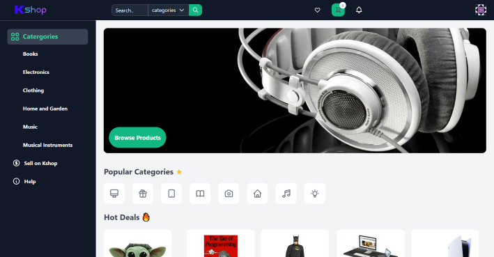
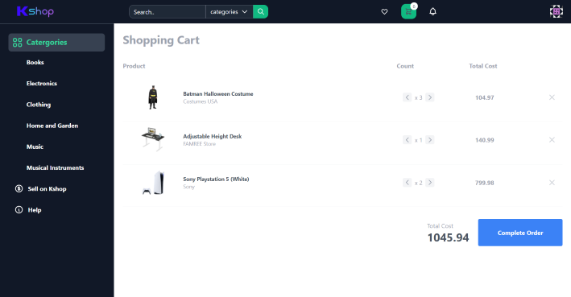

# AmazonJS

## Table of Contents

- [Description](#description)
- [Usage](#usage)
- [License](#license)
- [Questions](#questions)

## Description

This application is built using HTML, JavaScript, and Tailwind CSS. The webpage is a simulated online marketplace made with the purpose of practicing JavaScript and front-end design.

## Usage

Products can be added to the user's cart, which can be accessed by clicking the cart icon on the navigation menu. The user can return to the homepage by clicking the logo in the top left.

Deployed application: https://kshopjs.web.app/

## License

This project is licensed with MIT.

## Questions

Follow me on [Github](https://github.com/Kayvonk).

To contact me, send an email to kayvonk@gmail.com with your name and inquiry.
